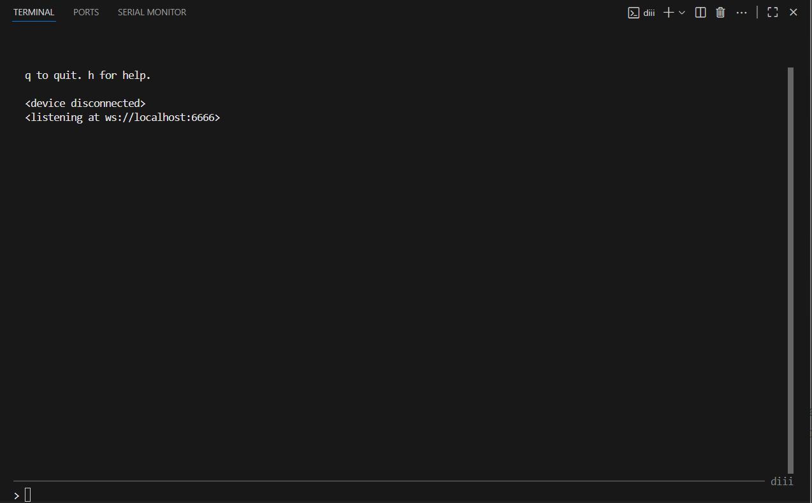

<h1>Iiinst & Siiiq</h1>

A collection of instrument and sequencer scripts for iii devices.

- [Installation](#installation)
- [First time setup](#first-time-setup)
- [Scripts](#scripts)
- [Troubleshooting](#troubleshooting)
  - [Flip Device Mode](#flip-device-mode)
  - [DeviceNotFoundError(f"can't find iii device")](#devicenotfounderrorfcant-find-iii-device)
  - [Uploading script gets stuck on "-- receiving script" step](#uploading-script-gets-stuck-on----receiving-script-step)
- [Credits](#credits)

## Installation

> [!CAUTION]
> Make sure to follow [First Time Setup](#first-time-setup) steps before attempting to install any scripts.

**VS Code Steps:**

1. Open this folder in VS Code
2. Run launch diii Task: `ctrl+shift+p` type `run task` and select `Launch diii`
3. Connect your iii enabled `Arc` or `Grid` (Zero/One)

**Command Line Steps:**

1. Choose a script to install from the [Scripts](#scripts) section.
2. Connect your iii enabled `Arc` or `Grid` (Zero/One)
3. Open your terminal of choice and run the following commands:

**Grid:**

```bash
diii -c
diii -u ./grid/<script name>.lua
```

**Arc:**

```bash
diii -c
diii -u ./arc/<script name>.lua
```

> [!NOTE] It is good practice to clear any active iii scripts before installing a new one. If a larger script is already running while attempting to upload a new script, the upload can fail.

## First time setup

There are two ways to set up your local copy of this project. **The fastest and simplest way is through the included `VS Code` tasks.** If you just want it to work or are not comfortable with command line things, this is the easiest and fastest way down the mountain.

Start by installing [VS Code](https://code.visualstudio.com/) from the official web page (Always check the url).

1. Install [python 3.11](https://www.python.org/downloads/release/python-31113/) (last tested with `3.11.13`)
2. Run the setup script via one of the following methods:

**VS Code:**

Run the setup enviornment task: `ctrl+shift+p` type `run task` and select `Setup Environment`

**Terminal:**

```bash
# Windows (PowerShell):
./scripts/setup-diii.ps1

# Linux/MacOS (Bash):
source scripts/setup-diii.sh
```

Launch `diii` with one of the following methods, you should see a console similar to the image below:



**VS Code:**

1. Run the Launch diii task: `ctrl+shift+p` type `run task` and select `Launch diii`
2. Terminal: Open a new terminal in VS Code and run `diii`

**Terminal:**

```bash
# Windows (PowerShell):
./.venv/Scripts/activate.ps1; diii

# Linux/MacOS (Bash):
source .venv/Scripts/activate && diii
```

To exit `diii`, type `q` into the console and press `enter`. For other `diii` commands check out the docs [here](https://github.com/monome/iii?tab=readme-ov-file#run).

## Scripts

| Name                                                              | Compatable Devices  | Type       | Description                             |
| ----------------------------------------------------------------- | ------------------- | ---------- | --------------------------------------- |
| [Piiiano](./manuals/piiiano-manual.pdf)                           | Grid (Zero and One) | Instrument | Grid based chromatic midi keyboard      |
| [Iiimpact](./manuals/iiimpact-manual.pdf)                         | Grid (Zero and One) | Instrument | Drum pad midi instrument                |
| [Fadiiir](./manuals/fadiiir-manual.pdf)                           | Grid (Zero and One) | Controller | 16 virtual MIDI CC faders               |
| [Percusiiions](./manuals/percusiiions-manual.pdf)                 | Grid (Zero and One) | Sequencer  | Simple 16 step, 8 track, step sequencer |
| [Melodiiies](./manuals/melodiiies-manual.pdf)                     | Grid (Zero and One) | Sequencer  | Scale aware polyphonic step sequencer   |
| [Multiii Body Problem](./manuals/multiii-body-problem-manual.pdf) | Arc                 | Sequencer  | Scale aware polyphonic step sequencer   |

## Troubleshooting

### Flip Device Mode

Here is a [description of device modes](https://github.com/monome/iii?tab=readme-ov-file#modes) when running `iii` compatible firmware. Follow steps outlined in that section of the `iii` docs to flip the device between `iii` and `standard serial` modes.

### DeviceNotFoundError(f"can't find iii device")

Error message:

```shell
  File "C:\Users\jguza\source\repos\iiiano\.venv\Lib\site-packages\diii\cli.py", line 43, in upload
    iii.connect()
  File "C:\Users\jguza\source\repos\iiiano\.venv\Lib\site-packages\diii\iii.py", line 48, in connect
    self.serial = self.find_device()
                  ^^^^^^^^^^^^^^^^^^
  File "C:\Users\jguza\source\repos\iiiano\.venv\Lib\site-packages\diii\iii.py", line 30, in find_device
    portinfo = find_serial_port('USB VID:PID=CAFE:1101')
               ^^^^^^^^^^^^^^^^^^^^^^^^^^^^^^^^^^^^^^^^^
  File "C:\Users\jguza\source\repos\iiiano\.venv\Lib\site-packages\diii\iii.py", line 21, in find_serial_port
    raise DeviceNotFoundError(f"can't find iii device")
diii.exceptions.DeviceNotFoundError: can't find iii device
```

**Solution:** This is likely due to the device not connected to the computer or not being in iii mode. Follow the instructions [here](https://github.com/monome/iii?tab=readme-ov-file#modes) to flip modes.

If you run into a problem that isn't captured in this section, please [submit issues here](https://github.com/JGuzak/iiiano/issues). Make sure to include things like system information and screenshots/logs for the best chance of assistance.

### Uploading script gets stuck on "-- receiving script" step

Sometimes scripts don't clear properly when attempting to upload new scripts.

**Solution:** Follow one of the two suggestions to clear the currently loaded script then re-flash the desired script:

- [force clear iii script by following steps outlined in the `iii` docs](https://github.com/monome/iii?tab=readme-ov-file#modes)
- disconnect/reconnect the device, launch `diii` if it isn't already running, run `^^c` to clear the script

## Credits

Big thanks to the following individuals for testing early builds, suggesting features, and being over all great humans;

- Juicy Noise Bits
