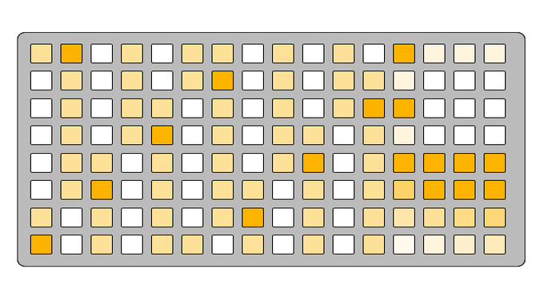
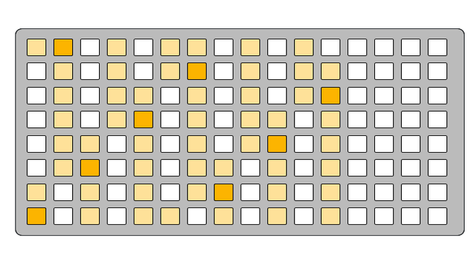

<h1>Piiiano Manual</h1>

- [Abstract](#abstract)
- [Features](#features)
- [Idea Brainstorm](#idea-brainstorm)
- [Technical Specifications](#technical-specifications)
- [Interface Regions](#interface-regions)
- [Keybed](#keybed)
- [Layer Selection](#layer-selection)
- [Performance Layer](#performance-layer)
- [Keybed Layer](#keybed-layer)
- [MIDI Layer](#midi-layer)
- [Troubleshooting](#troubleshooting)
  - [No MIDI Output](#no-midi-output)
  - [Unexpected Note Layout](#unexpected-note-layout)
  - [Notes Stuck On](#notes-stuck-on)

## Abstract

iiiano is a USB MIDI keyboard script for Monome Grid devices that transforms your Grid One or Zero into a versatile musical instrument. The script provides an 8x12 keybed with multiple layout modes, scale selection, velocity control, and configurable MIDI output channel.

## Features

- 8 x 12 keybed (On One), 8 x 16 keybed (On Zero)
- ±2 Octave transpose
- 16 velocities
  - Selected note brightness matches velocity
- Note hold toggle
- Selectable root note
- Selectable scale
- Keybed layout modes
  - Octave
  - 3rds
  - 4ths
- Selectable MIDI output channel
- MIDI PANIC button

## Idea Brainstorm

- In Key toggle
- ~~Rotatable keyboard~~
- Adjustable velocity
  - Random velocity with range control and randomness distribution adjustment?
  - Hold Select minimum/maximum button and press one of the 16 velocities
  - Velocity mode button toggles between static velocity and random velocity
- Note Hold modes
  - ?Sostenuto? - Like damper but only occurs for notes that were pressed while sostenuto button is held. Not sure if this would fit into the grid UI :/
- MIDI note input light up keybed
- Zero support
  - Show all layers at the same time across the top half and extend keybed all the way across the bottom half
- Split MIDI channel keybed

## Technical Specifications

- **Grid Compatibility**: Monome Grid One (8x16) and Zero (16x16)
- **MIDI Output**: MIDI note on/off messages
  - **Velocity Range**: 10-127 (16 discrete levels)
  - **Transpose Range**: ±2 octaves
  - **MIDI Channels**: 1-16
- **Root Note**: Configurable root note
- **Scales**: 10 predefined scales
- **Layout Modes**: 3 different keybed arrangements

## Interface Regions

The Grid One interface is divided into three main regions.

| Keybed                                     | Layer                                    | Layer Select                                           |
| ------------------------------------------ | ---------------------------------------- | ------------------------------------------------------ |
|  |  |  |

Grid Zeros don't have layer selection because all layers are visible on the top half of the device.

| Keybed                                          | Performance Layer                                                     | Keybed Layer                                                | MIDI Layer                                              |
| ----------------------------------------------- | --------------------------------------------------------------------- | ----------------------------------------------------------- | ------------------------------------------------------- |
|  |  |  |  |

## Keybed

The keybed provides a grid-based interface for playing notes with visual feedback.

| Grid One                                                         | Grid Zero                                                          |
| ---------------------------------------------------------------- | ------------------------------------------------------------------ |
|  |  |

- **Root Note Highlighting**: Root notes appear at maximum brightness
- **Scale Note Highlighting**: Notes in the current scale appear at medium brightness
- **Same-Note Highlighting**: When a note is pressed, all instances of that note class are highlighted
- **Velocity Feedback**: Pressed keys display brightness corresponding to their velocity value

## Layer Selection

The layer selection zone contains three main layers accessible via the top row.

| -   | 13                | 14                | 15         | 16  |
| --- | ----------------- | ----------------- | ---------- | --- |
| A   | Performance Layer | Keybed Edit Layer | MIDI Layer | -   |

## Performance Layer

| Grid One                                                         | Grid Zero                                                          |
| ---------------------------------------------------------------- | ------------------------------------------------------------------ |
|  |  |

*Only on Grid One:* Access the Performance Layer by pressing `13A`.

| -   | 13              | 14                 | 15                    | 16                 |
| --- | --------------- | ------------------ | --------------------- | ------------------ |
| A   | -               | -                  | -                     | -                  |
| B   | Transpose Up    | Note Hold (Toggle) | Note Hold (Momentary) | Note Hold (Damper) |
| C   | Transpose Reset | Toggle Vel mode    | Min Vel Select        | Max Vel Select     |
| D   | Transpose Down  | Toggle Vel mode    | Min Vel Select        | Max Vel Select     |
| E   | Vel 105         | Vel 113            | Vel 119               | Vel 127 (Max)      |
| F   | Vel 76          | Vel 83             | Vel 90                | Vel 98             |
| G   | Vel 53          | Vel                | Vel 61                | Vel 68             |
| H   | Vel 10 (Min)    | Vel 17             | Vel 25                | Vel 39             |

The currently selected velocity blinks between maximum brightness and dim brightness to indicate selection.

***Note Hold***

There are three behavioral variations for holding notes;

1. Toggle - While the button is illuminated, pressed notes will be held. When this is pressed again, all held notes are released.
2. Momentary - Note hold will only be engauged while this button is held. When this button is released, all held notes are released.
3. Damper - This behavior mimics the damper pedal on pianos. While this button is illuminated, note hold is engauged just like Toggle. The other two note hold buttons (Toggle and Momentary) release held notes on press.

***Transpose Control***

Transpose the keybed between +2 and -2 octaves. Pressing the up button moves the transposition up and inversley the down button moves the transposition down. Pressing the middle transpose button resets the keybed to the middle position (0).

***Velocity Controls***

Selectable from the 16 pads, flashing button represents the currently selected velocity.

Toggle between static and random velocity modes with `C14`.

Hold either `Min` or `Max` velocity select buttons and tap a pad from the 16 velocities grid. If the minimum velocity is above the maximum velocity, the range will be inverted.

*Note: While selecting minimum or maximum velocity values is locked to the velocities available on the pads, the random velocities are not quantized to the 16 values.*

## Keybed Layer

| Grid One                                               | Grid Zero                                                |
| ------------------------------------------------------ | -------------------------------------------------------- |
|  | /keybed_layer_zero.png |

*Only on Grid One:* Access the Keybed Edit Layer by pressing the button at position `15A`.

| -   | 13             | 14            | 15       | 16            |
| --- | -------------- | ------------- | -------- | ------------- |
| A   | -              | -             | -        | -             |
| B   | Major          | Dorian        | Phrygian | Lydian        |
| C   | Mixolydian     | Minor         | Locrian  | Natural Minor |
| D   | Harmonic Minor | Melodic Minor | -        | -             |
| E   | C              | C#            | D        | D#            |
| F   | E              | F             | G        | G#            |
| G   | A              | A#            | B        | -             |
| H   | Octave         | 3rds          | 4ths     | -             |

***Scales***

Rows `B` through `D` set the scale of the keybed.

***Root Node***

Rows `E` through `G` set the root note of the keybed.

***Keybed Offset***

Row `H` sets the row offset of the keybed.

| Octave                                                   | 3rds                                                 | 4ths                                                 |
| -------------------------------------------------------- | ---------------------------------------------------- | ---------------------------------------------------- |
|  |  |  |

## MIDI Layer

| Grid One                                           | Grid Zero                                            |
| -------------------------------------------------- | ---------------------------------------------------- |
|  | /midi_layer_zero.png |

*Only on Grid One:* Access the MIDI Layer by pressing the button at position `16A`.

| -   | 13    | 14    | 15    | 16    |
| --- | ----- | ----- | ----- | ----- |
| A   | -     | -     | -     | -     |
| B   | PANIC | PANIC | PANIC | PANIC |
| C   | PANIC | PANIC | PANIC | PANIC |
| D   | -     | -     | -     | -     |
| E   | Ch 1  | Ch 2  | Ch 3  | Ch 4  |
| F   | Ch 5  | Ch 6  | Ch 7  | Ch 8  |
| G   | Ch 9  | Ch 10 | Ch 11 | Ch 12 |
| H   | Ch 13 | Ch 14 | Ch 15 | Ch 16 |

***MIDI Channel Selection***

The currently selected channel appears at maximum brightness.

***PANIC***

Press and hold any button in this area to send MIDI All Notes Off (CC 123) on all 16 MIDI channels. This stops all currently playing notes.

## Troubleshooting

### No MIDI Output

- Verify MIDI channel selection in MIDI Layer
- Check USB MIDI connections and receiving device settings
- Ensure iii firmware is up to date

### Unexpected Note Layout

- Check current keybed layout mode (octave/3rds/4ths)
- Verify root note selection
- Confirm scale selection matches intended key

### Notes Stuck On

- Use MIDI Panic function in MIDI Layer
- Check for proper note-off messages
- Restart the script if necessary
